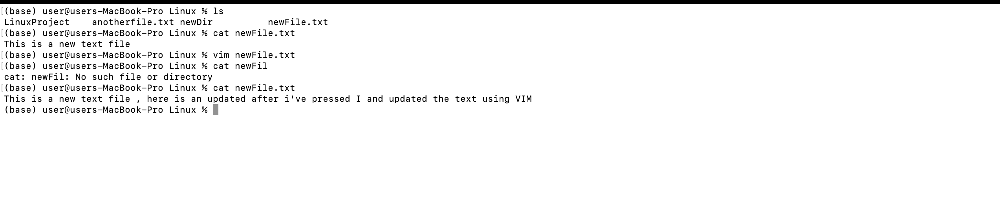

## Module 2: File Operations and Navigation
### Task 4 : Working with Text Files
- Used `cat`, `nano`, or `vim` to view and edit text files.
- Demonstrated appending and replacing content in a file.
- [Extended explantion and showcase of this task](./task4.md)

#### In the following screenshot it is demonstrated how I have :
 - Created a new text file
 - Wrote a sentence in it using cat command 
 - Used vim command to edit it
 - Used Cat command to show that the content has changed after using vim

 - First screenshot shows how i have used the cat and the VIM commands : 
   

 - Second screenshot shows how I entered the vim editor , and how i have edited it after pressing i.
 - to quit the editor we need to press : and then write wq! or x!
    
