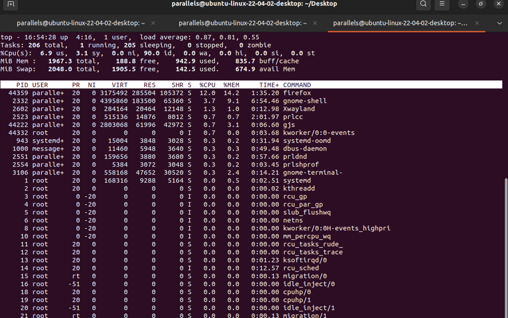
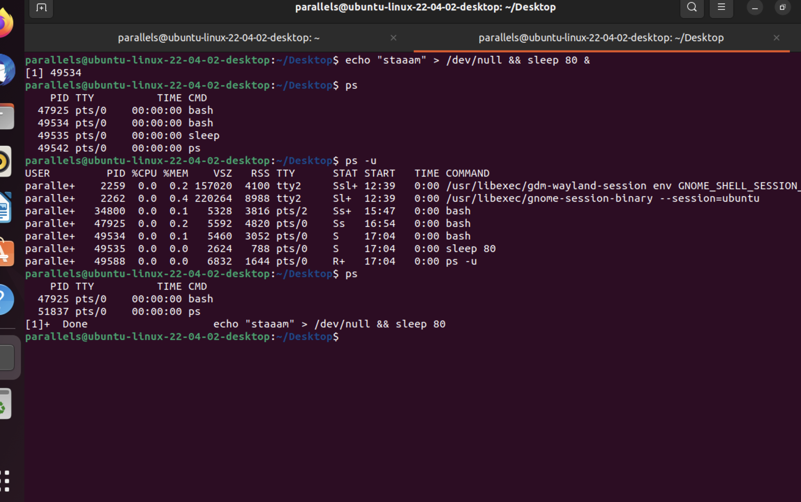

## Module4: User Management and Permissions

### Task 7: Process Monitoring
- Monitored system processes using `ps` , `top`
- Identifed resource-intensive processes and terminated them using `kill`.

#### Process States in Linux 
 - Running
 - Sleeping
  - Interruptible sleep
  - Uninterruptible sleep
 - Stopped
 - Zombie

#### TOP command : tracks the running processes
- PID: Unique Process ID given to each process.
- User: Username of the process owner.
- PR: Priority given to a process while scheduling.
- NI: ‘nice’ value of a process.
- VIRT: Amount of virtual memory used by a process.
- RES: Amount of physical memory used by a process.
- SHR: Amount of memory shared with other processes.
- S: state of the process
 - ‘D’ = uninterruptible sleep
 - ‘R’ = running
 - ‘S’ = sleeping
 - ‘T’ = traced or stopped
 - ‘Z’ = zombie
-%CPU: Percentage of CPU used by the process.
-%MEM; Percentage of RAM used by the process.
-TIME+: Total CPU time consumed by the process.
-Command: Command used to activate the process.

#### In the following screenshot it is demonstrated how I have :
- Used `top` command to show extensive information about every process in the system
- It is shown that FIREFOX is the most resource-intensive processes , that can be seen by looking at the %CPU column
- The process can be terminated by using the command 'kill with %PID' ( Will be used in the upcoming task
- Ran a dummy echo command and made it sleep for sometime so I can show the process in the ps list
- Used `ps` command to show extensive information about every process in the system
- 
- 

