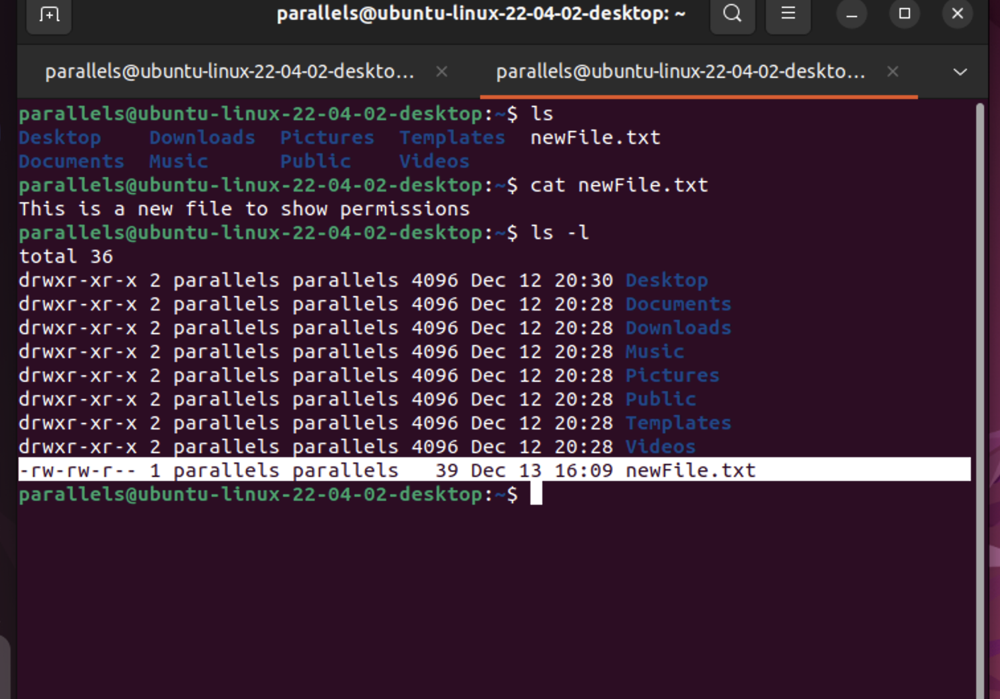
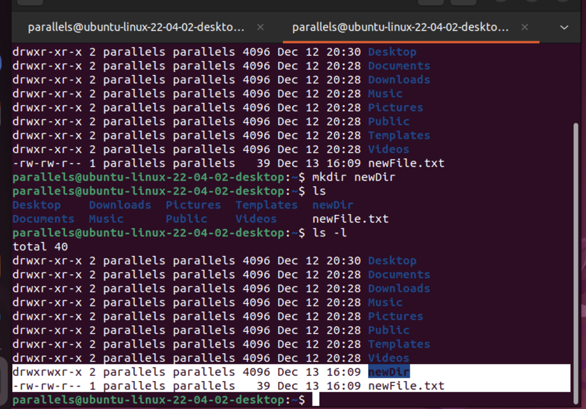
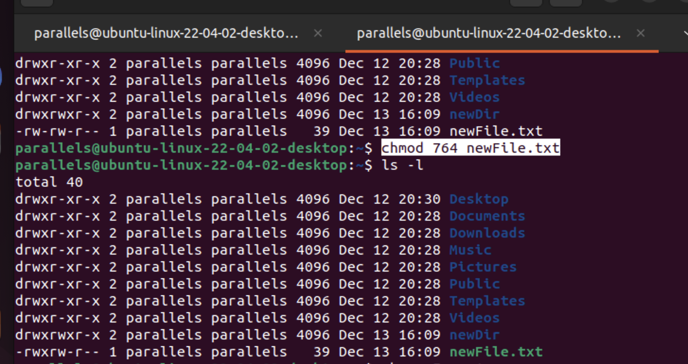
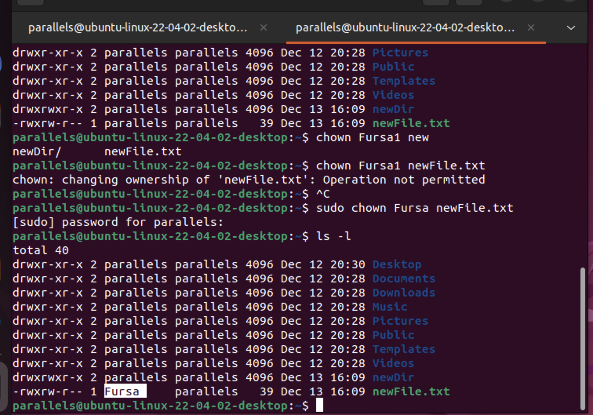

## Module3: User Management and Permissions

### Task 6: File Permissions
- Understood and modified file permissions using `chmod`.
- Explored the concepts of user, group, and others.

#### Explantion regarding permissions in linux:
- Permissions can be seen in this weird looking code (highlighted ‘-rw-rw-r–‘ in the screenshot down) , this code tells us about the Unix permissions given to the owner, user group and the world.
- r = read permission , w = write permission ,  x = execute permission , – = no permission
- 
- 

#### In the following screenshot it is demonstrated how I have :
- Created a new file using `cat` command
- Created a new dirctory using `mkdir` comand
- used the `ls -l` command which shows more extended information about the files and folders including their permissions
- Showed the permissions given for each file and dirctory
- 
- Changed the permissions for newFile.txt using `chmod` command
- 764 means : 7 - rwx for user , 6 rw- for group , 4 r-- for others
- 
- Changed the ownership over the file using `chown` command
- 

