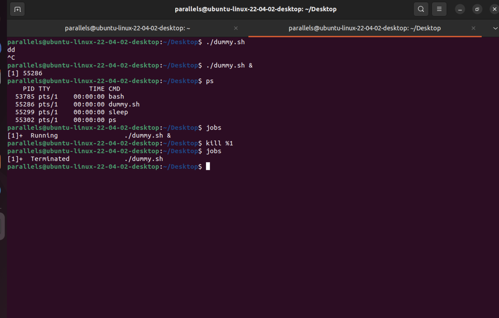

## Module4: Process Management

### Task 8: Background and Foreground Processes
- Ran a process in the background
- Moved a process to the foreground.
- Ultlized relevant commands

 

#### In the following screenshot it is demonstrated how I have :
- Created a dummy script that runs in an infinite loop , the script was written and edited using `vim`
- 
- Ran the script in a regular way by calling it in the shell using `./dummy.sh` , and then stopped it using `CTRL+C`
- Ran the script in back ground by adding `&`
- Checked the running jobs by running the `jobs` command
- Moved the process from bg to fg by using the `fg %id` while the id is the id of the process in the jobs list
- Used `kill` to terminate the process
- 
- 

