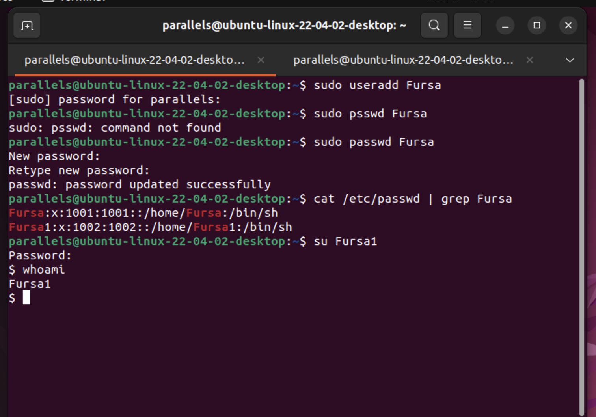

## Module3: User Management and Permissions

### Task 5: User Accounts
- Created a new user account and set a password.
- Switched between users using `su` and `sudo`.
- Provided screenshots of user creation and switching.

#### In the following screenshot it is demonstrated how I have :
- Created a new user using `useradd command`
- Created 2 new users Fursa and Fursa1 (Fursa with flag m which connects a home directory to it)
- Setup a password for each user using `passwd`
- Switched between users using `su`
- Showed in which users I am currently in using `whoami`
- 

