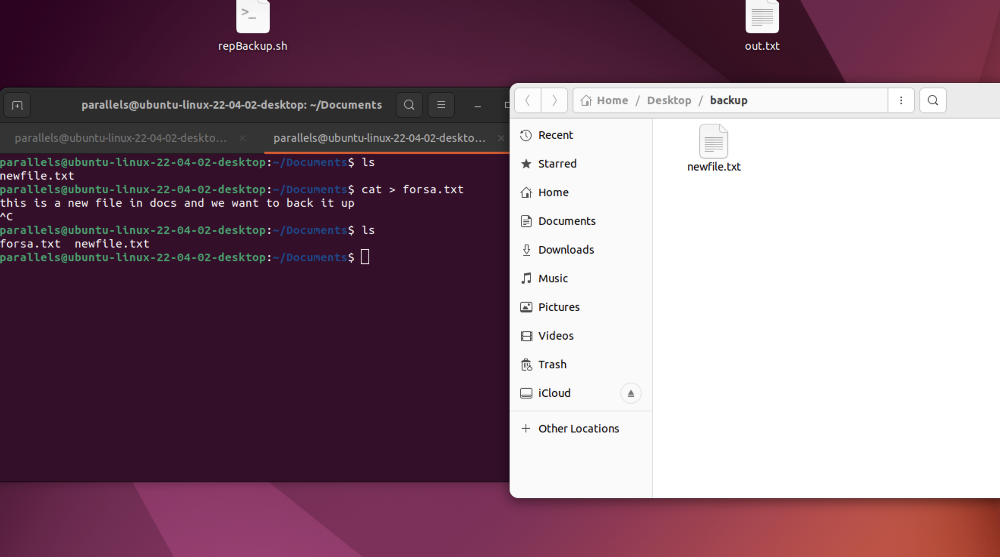

# LinuxProject

## Table of Contents of Module6
- [Module 6: Basic Shell Scripting](#module-6-basic-shell-scripting)
  - [Task 11: Write a Shell Script](#task-11-write-a-shell-script)
 

### Task 11: Automated Script

- [The Bash script can be found here](./repBackup.sh)
- Wrote a bash script that automates the file backup opeartion 
- The code assigns values to two variables `SRC_DIR` and `DST_DIR`. These variables are used to store the source directory and backup directory paths, respectively.
- First of all the code checks if the destantion directory exists using a conditional statement. If the directory doesn’t exist, create one using the mkdir command.
  - The dollar sign $ before the DST_DIR variable is used to denote the variable and retrieve its value.
  - the fi  closes the conditional statement.
  - d flag checks if the directory exitx.
 
- Second it copies all of the files from the source directory to the destination directory using a for loop :
  - the `for file in "$SRC_DIR"/*; do` , line initiates a loop that iterates over each file in the directory specified by the SRC_DIR variable.
  - the `*` is a wildcard that means that match any file in the source dir.
  - the `cp "$file" "$DST_DIR"` copies the corresponding files from the source to the dest
  - the do and done indicates the start and the end of the loop , respectivly.

- After running the script by running `repBackup.sh` command , we can check the backup file and see that the new files has moved there as shown in the following screenshots before and after.
- 
- 

 

